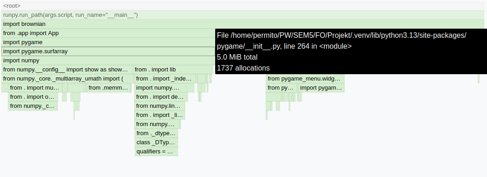
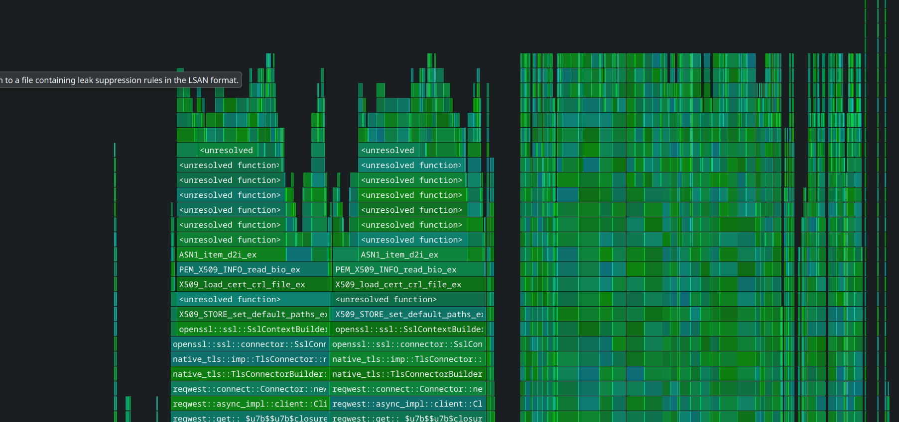
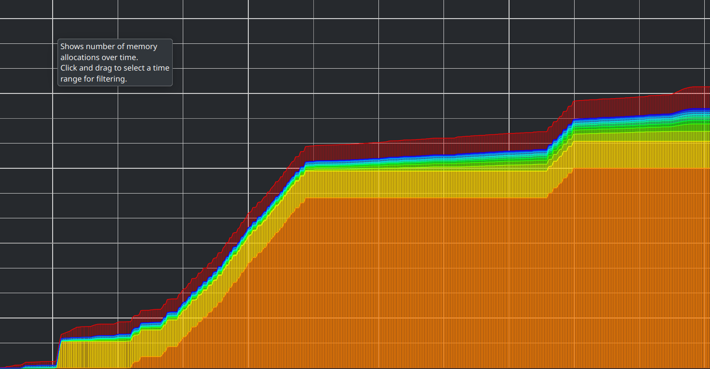

# Profilowanie kodu Python i Rust

Piotr Jabłoński <piotr.jablonski10.stud@pw.edu.pl>

Poniższa instrukcja przedstawia *wybrane* narzędzia oraz sposoby ich użycia umożliwające mierzenie wydajności bibliotek czy programów wykonywalnych. Omawiane są dwie osobne metryki profilowania dla obu języków:

1. Profilowanie CPU - czas wykonywania poszczególnych funkcji, zliczenie wykonań, użycie procesora
2. Profilowanie pamięciowe - analiza alokacji i użycie pamięci

Należy pamiętać że profilowanie wykonuje programy 10-30x wolniej niż normalnie.

## Python - moduł cProfile

Do analizy wydajności programu pod kątem *CPU* można użyć wbudowanego modułu w Pythonie o nazwie `cProfile`. Może być on wykorzystywany zarówno wewnątrz kodu bibliotecznego oraz zewnątrz - traktując program jako czarna skrzynka

Alternatywy: [profile](https://docs.python.org/3/library/profile.html#module-profile), [py-spy](https://github.com/benfred/py-spy)

### Podstawowe użycie w kodzie

```python
import cProfile

if __name__ == "__main__":
    profiler = cProfile.Profile()
    profiler.enable()

    n = 30
    for i in range(n):
        x = fib(i)
        x += a(x, i)
        x -= b(i, x, i + x)
        x *= c(i)

    profiler.disable()
    profiler.print_stats(sort='time')

    # profiler.dump_stats('profile_results.prof')

    # import pstats
    # p = pstats.Stats('profile_results.prof')
    # p.strip_dirs().sort_stats('time').print_stats()
```

### Podstawowe użycie z zewnątrz

```shell
python -m cProfile [script.py]
```

Wynik wykonania programu jest identyczny jak w poprzednim przypadku. Główną zaletą tego rozwiązania jest fakt, że nie ma potrzeby modyfikowania kodu biblioteki, aby przeprowadzić profilowanie. Wadą natomiast jest brak precyzyjnej kontroli nad zakresem profilowania - analizie poddawany jest praktycznie cały wykonywany kod.

### Interpretacja wyników


- **ncalls**: liczba wywołań funkcji
- **tottime**: całkowity czas spędzony w funkcji (bez funkcji zagnieżdżonych)
- **percall**: czas na wywołanie (tottime/ncalls)
- **cumtime**: całkowity czas w funkcji wraz z funkcjami zagnieżdżonymi
- **filename:lineno(function)**: lokalizacja i nazwa funkcji

[Więcej informacji](https://docs.python.org/3/library/profile.html)

## Python - program memray

Memray to zaawansowany profiler pamięci dla Pythona, który pozwala śledzić alokacje pamięci, wykrywać wycieki i analizować zużycie pamięci w czasie rzeczywistym. Nie jest on wbudowany do Pythona i wymaga osobnej instalacji:

```shell
pip install memray
```

Alternatywy: [memory-profiler](https://pypi.org/project/memory-profiler/), [tracemalloc](https://docs.python.org/3/library/tracemalloc.html)

### Podstawowe użycie w kodzie

```python
import memray

with memray.Tracker("output_file.bin"):
    print("Allocations will be tracked until the with block ends")

    # for _ in range(100):
    #     strings = process_strings(1000)
```

Wszystkie alokacje wewnątrz bloku `with` będą śledzone. System przechwytuje również alokacje wykonane przez inne wątki w trakcie działania tego bloku. Ze względu na sposób działania mechanizmu śledzenia:

- W całym programie może być aktywny tylko jeden tracker w danym momencie
- Próba aktywacji trackera, gdy inny jest już aktywny, spowoduje zgłoszenie wyjątku

### Podstawowe użycie z zewnątrz

```shell
python -m memray run [script.py]
# lub
python -m memray run -o "output_file.bin" [script.py]
# lub
python -m memray run --live [script.py] # otwiera TUI i pozwala śledzić przebieg alokacji programu na żywo, nie produkuje pliku binarnego .bin
# lub
memray [options] [script.py]
```

### Interpretacja wyników (pliku binarnego .bin)

Po wykonaniu programu generowany jest plik binarny, który można przeanalizować za pomocą wbudowanych do `memray` narzędzi.

#### Podsumowanie alokacji

```shell
memray stats memray_profile.bin
```


#### Generowanie raportu w formie flame graph

```shell
memray flamegraph memray_profile.bin
```



#### Wykrycie wycieków pamięci

```shell
memray leak memray_profile.bin
```

[Więcej informacji](https://bloomberg.github.io/memray/)

## Rust - program perf

Narzędzie perf to zaawansowany profiler systemowy dostępny w środowisku Linux, umożliwiający szczegółową analizę wydajności programów na niskim poziomie. W przeciwieństwie do profilerów językowych (takich jak pythonowy `cProfile`), perf:

- Obsługuje analizę programów napisanych w różnych językach, w tym C/C++ i Rust
- Nie zapewnia możliwości integracji profilera z kodem źródłowym
- Zapewnia niskopoziomowy wgląd w działanie programu, integrując się z mechanizmami jądra systemu

Wymagana osobnej instalacji:

```shell
sudo apt install perf
```

Alternatywy: [valgrind](https://valgrind.org/) --tool=callgrind

### Podstawowe użycie

Fragment kodu, na którym testowane jest narzędzie `perf`:

```rust
fn main() {
    let n = 30;
    for i in 0..n {
        let mut x = fib(i);
        x += a(x as f64, i as f64) as i32;
        x -= b(i as f64, x as f64, (i + x) as f64) as i32;
        x *= c(i);
    }
}
```

#### Wymagana kompilacja programu

```shell
rustc -g -o cpu cpu.rs
```

Flaga `-g` zapewnie dodatkowe informacje debugowe

#### Nagranie danych profilowych

```shell
perf record --call-graph dwarf ./cpu
```

Opcja `--call-graph dwarf` zapewnia dokładniejsze śledzenie stosu wywołań

#### Generowanie raportu

> Do wizualizacji warto sprawdzić program [hotspot](https://github.com/KDAB/hotspot)

Plik **perf.data** można otworzyć przez wiele narzędzi, w tym parę graficznych. Natomiast program `perf` zawiera wbudowany podgląd wyników:

```shell
perf report
```


### Interpretacja wyników

Wyniki perf report pokazują:

- Procentowy udział każdej funkcji w całkowitym czasie wykonania
- Hierarchię wywołań - jakie funkcje wywołują inne funkcje

[Więcej informacji](https://perfwiki.github.io/main/)

## Rust - program heaptrack

Heaptrack to odpowiednik programu `memray` dla języków natywnych - pozwala na:

1. Śledzenie wszystkich alokacji i dealokacji pamięci
2. Identyfikację wycieków pamięci
3. Analizę przyrostowego zużycia pamięci
4. Generowanie szczegółowych raportów z wizualizacją

Wymagana osobnej instalacji:

```shell
sudo apt install heaptrack
```

Alternatywy: [valgrind](https://valgrind.org/) --tool=memcheck, [valgrind](https://valgrind.org/) --tool=massif, [valgrind](https://valgrind.org/) --tool=dhat

### Podstawowe użycie heaptrack

Kod, na którym testowane jest narzędzie `heaptrack`:

```rust
fn process_strings(count: usize) -> Vec<String> {
    let mut result = Vec::with_capacity(count);
    for i in 0..count {
        let s = " ".repeat(i * 1000);
        result.push(s);
    }
    result
}

fn main() {
    for _ in 0..100 {
        let strings = process_strings(100);
    }
}
```

#### Wymagana kompilacja programu

```shell
rustc -g -o mem mem.rs
```

Flaga `-g` zapewnie dodatkowe informacje debugowe

#### Nagranie danych profilowych i wyświetlenie raportu

```shell
heaptrack ./mem
```

Otworzy się okno graficzne z analizą pamięciową


### Interpretacja wyników

Po zakończeniu działania programu, heaptrack generuje szczegółowy raport zawierający:

- Wykres zużycia pamięci w czasie - pokazuje wzrosty i spadki alokacji
- Listę funkcji alokujących najwięcej pamięci
- Statystyki alokacji:
  - Łączna liczba alokacji
  - Łączny rozmiar zaalokowanej pamięci
  - Maksymalne zużycie pamięci
- Potencjalne wycieki pamięci - fragmenty kodu gdzie pamięć nie została zwolniona
- Dostępne jest wiele widoków, np.
  - flamegraph alokacji 
  - czy wykres ilości alokacji w czasie 

[Więcej informacji](https://invent.kde.org/sdk/heaptrack)
